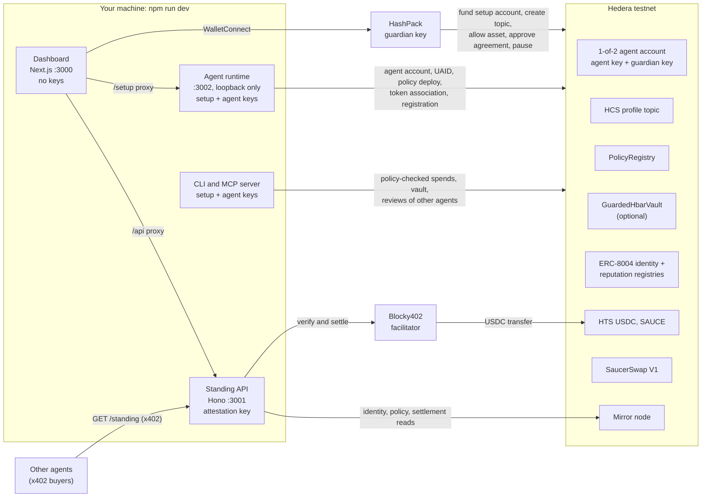
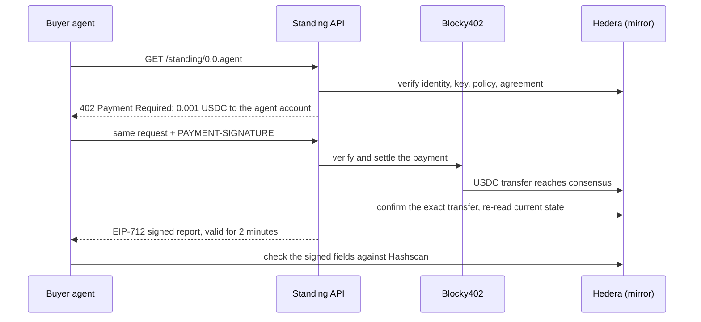

# Accountable Agent

**Give an AI agent on Hedera a human guardian, a verifiable identity, and spending rules a counterparty can check.** One command scaffolds the dApp; the browser sets up the agent.

Accountable Agent is a [Scaffold-HBAR](https://github.com/hedera-dev/create-scaffold-hbar) template. It creates a 1-of-2 Hedera account that the agent and a human guardian both control, registers the agent's identity on HCS and ERC-8004, records guardian-approved spending terms on-chain, and sells a signed **standing report** over x402 so other agents can verify it before dealing with it. Testnet only.

---

## The problem

Anyone can hand an AI agent a wallet. Nothing about that wallet makes the agent trustworthy with money: no one is visibly answerable for it, its spending rules live only in its own code, and there is no clean way to stop it or get the funds back when it misbehaves. A counterparty has no way to check any of this before dealing with it.

---

## Features

- **Guardian-controlled account** — a 1-of-2 Hedera key: the agent signs on its own; the guardian can pause it or revoke its key
- **Browser setup** — `npm run dev`, connect HashPack, approve four transactions; a local agent runtime does the rest
- **Verifiable identity** — HCS profile topic, HCS-14 UAID and ERC-8004 registration on Hedera testnet
- **Guardian-approved terms** — the agreement hash is published to HCS and bound into every standing report
- **Paid standing** — `GET /standing/:id` sells an EIP-712 signed report over x402 (USDC via Blocky402, settlement confirmed on the mirror)
- **Agent lookup and reputation** — verify any other agent by its ERC-8004 ID before dealing with it, and rate agents you dealt with in the ERC-8004 reputation registry on Hedera
- **Contract-enforced vault (optional)** — caps, recipient allowlist, pause and recovery that hold even if the agent bypasses its client
- **Guardian wallet controls** — pause, unpause and vault recovery from HashPack in the dashboard
- **Optional DEX example** — a policy-checked SaucerSwap swap on testnet

---

## Prerequisites

- **Node.js** ≥ 22.13 (24 recommended) — [nodejs.org](https://nodejs.org/)
- **Git** (with `user.name` and `user.email` configured) — [git-scm.com](https://git-scm.com/)
- **npm** (the template uses npm workspaces)
- **HashPack** with an **ECDSA** Hedera testnet account holding about **50 HBAR**; it becomes the guardian. [Get testnet HBAR](https://portal.hedera.com/)

No Foundry install is needed: the template uses Hardhat.

---

## Quick start

Scaffold without prompts:

```sh
npx create-scaffold-hbar@latest agent-leash -t i-mwangi/Agent-leash -y --skip-hedera-skills --frontend nextjs-app --solidity-framework hardhat --network testnet --package-manager=npm
```

Then run:

```sh
cd agent-leash
npm run check
npm run dev
```

Open `http://localhost:3000` and go to **Create agent** ([browser setup](#set-up-an-agent-in-the-browser)).

`npm run dev` starts three processes: the dashboard at `http://localhost:3000`, the API at `http://127.0.0.1:3001` and the local agent runtime at `http://127.0.0.1:3002`. Before starting, it creates any missing local key files (`.env.operator`, `.env.agent`, `.env.server`; ignored by git, never printed, never overwritten) and compiles the contracts if needed. Until this workspace has a complete, verified deployment, the dashboard shows an explicitly labelled synthetic demo.

### Interactive scaffold

To answer the scaffolder's questions instead:

```sh
npx create-scaffold-hbar@latest -t i-mwangi/Agent-leash
```

| Question                                | Choose                                      |
| --------------------------------------- | ------------------------------------------- |
| What is your project name?              | A lowercase name, for example `agent-leash` |
| Install Hedera Skills marketplace …?    | Either; **Yes** only adds agent guide files |
| Which Hedera network?                   | **Testnet** (the template is testnet-only)  |
| Install dependencies after scaffolding? | **Yes**                                     |
| Which frontend framework? _(if asked)_  | **Next.js (App Router)**                    |
| Which Solidity framework? _(if asked)_  | **Hardhat**, not the default Foundry        |
| Which package manager? _(if asked)_     | **Npm**, not the default Yarn               |

The last three questions normally do not appear: the scaffolder reads Next.js, Hardhat and npm from this template's `template.json`. They appear only if it cannot fetch that file, and then their defaults (Foundry, Yarn) are wrong for this template. The interactive form needs a real terminal.

**Scaffold notes:** the full command pins every option, so it also works when the scaffolder cannot fetch template defaults. `-y` skips prompts and `--skip-hedera-skills` skips the optional Hedera Skills install. If you use `npm create` instead of `npx`, put `--` before the project name; npm 11 otherwise consumes the template flag.

### Smoke check

With `npm run dev` running and no deployment yet: the dashboard, `http://127.0.0.1:3001/health` and `/status` return 200 in demo mode, and `/standing/:id` returns unpaid **503** because no identity or payment source is configured. It never substitutes a mock 402.

---

## Set up an agent in the browser

After `npm run dev`, open **Create agent** and click **Connect HashPack**. The page asks for four HashPack approvals; the local agent runtime performs every other step.

| Step                                            | Who                 |
| ----------------------------------------------- | ------------------- |
| Connect the guardian wallet                     | HashPack connection |
| Fund the local setup account with 45 HBAR       | HashPack approval   |
| Create the 1-of-2 agent account                 | Agent runtime       |
| Create the HCS profile topic (guardian admin)   | HashPack approval   |
| Publish the UAID and deploy the policy contract | Agent runtime       |
| Allow the spend asset in the policy             | HashPack approval   |
| Associate tokens and register ERC-8004          | Agent runtime       |
| Review and approve the agreement                | HashPack approval   |

When setup finishes, the API verifies the deployment (identity, HCS records, policy, registry card and agreement) and the dashboard switches from demo to live testnet data without a restart. If verification fails, it keeps serving demo and standing stays unpaid 503.

**What to know**

- **Cost.** The setup account (the generated `.env.operator` key) pays the policy deployment, HCS records and ERC-8004 registration, owns the registration, and keeps any unspent HBAR. A measured testnet setup used 28.7 of the 45 HBAR.
- **Keys.** The browser receives only public keys. The setup and agent keys stay with the agent runtime; the API refuses to load either. The runtime listens on loopback only and rejects requests without its setup header or from another web origin.
- **Resumable.** Progress is re-read from the mirror: the setup account is found by its public key, and the topic by its exact guardian admin key and 1-of-3 submit key list. Runtime writes use the same operation store as the CLI, so a reload or crash never repeats a confirmed transaction. A wallet request with an unknown outcome stays pending until the mirror shows it succeeded, failed or expired.
- **Agreement approval.** The guardian's wallet publishes the exact terms, their hash and `approval: "guardian-hcs-transaction"` to the agent's topic. The guardian key signs that HCS transaction, and verifiers accept the record only when the mirror shows the guardian account as its payer. The page recomputes the terms hash before asking for approval. It is a technical policy record, not a legal agreement.
- **WalletConnect.** The template ships a public WalletConnect project ID so HashPack connects from a fresh scaffold. To use your own, set `NEXT_PUBLIC_WALLETCONNECT_PROJECT_ID` in `packages/nextjs/.env.local`.

**Verification status:** on 30 September 2026 the complete flow ran on Hedera testnet from a fresh public scaffold with all four steps **approved in HashPack** ([evidence](#browser-setup)): agent `0.0.10798474`, ERC-8004 agent `125`. The API then verified the deployment and wallet-approved agreement, switched to testnet on its own and returned a 402 standing challenge. An earlier run of the same flow, with a script-held guardian key, also produced a verified version 2 standing report.

---

## Architecture



- **Keys stay where they are used.** The dashboard holds none. The API holds only the attestation key that signs standing reports and refuses to start with a spend key in its environment. The agent runtime and CLI hold the setup and agent keys. The guardian key stays in HashPack (or `.env.guardian` for CLI setup).
- **Hedera is the source of truth.** Every check (identity, key state, pause, caps, agreement, payment settlement) is read from the mirror node at the moment it is needed, never from local state alone.
- **The agent's client enforces the policy** before every signature; only the optional vault enforces rules on-chain.

## Ecosystem integrations

Each integration carries part of the template's job. Removing any of the first four removes a capability, not a feature flag.

| Integration                      | What it does here                                                                                                                                      | Why the template needs it                                                                                                                                      | Live evidence                                                                                                                                                                |
| -------------------------------- | ------------------------------------------------------------------------------------------------------------------------------------------------------ | -------------------------------------------------------------------------------------------------------------------------------------------------------------- | ---------------------------------------------------------------------------------------------------------------------------------------------------------------------------- |
| **x402 + Blocky402**             | Sells the signed standing report: `402 Payment Required`, Blocky402 verifies and settles 0.001 USDC, the API confirms the exact transfer on the mirror | Standing is how a counterparty checks the agent before trusting it; x402 makes that check payable by another agent over plain HTTP, with no account or API key | [Paid standing](#cli-deployment-2527-september-2026), [version 2](#cli-deployment-2527-september-2026) and [version 3](#vaults) reports                                      |
| **ERC-8004 identity registry**   | Registers each agent; its card names the account, guardian, HCS topic, UAID, policy and standing endpoint; lookups verify any agent from it            | The shared directory where other agents find this one and see who answers for it                                                                               | Agents [121](https://hashscan.io/testnet/transaction/0.0.5792828%401790349275.514184066), [125](https://hashscan.io/testnet/transaction/0.0.10798471%401790805543.885864012) |
| **ERC-8004 reputation registry** | Agents rate agents they dealt with; every lookup lists the reviews with their reviewers                                                                | Turns individual checks into a shared track record; the registry blocks owners from rating their own agent                                                     | [First review](#agent-to-agent-lookup-and-review)                                                                                                                            |
| **HashPack (WalletConnect)**     | The guardian approves setup and signs pause, unpause and vault controls; the guardian key never leaves the wallet                                      | Puts a human in control without the template ever holding the guardian's key                                                                                   | [HashPack setup run](#browser-setup), [vault controls](#vaults)                                                                                                              |
| **SaucerSwap V1**                | The agent's example spend: a policy-checked SAUCE → WHBAR swap; the dashboard reads live quotes                                                        | Shows the policy check guarding a real DeFi action, not a mock transfer                                                                                        | [Policy-checked swap](#saucerswap)                                                                                                                                           |
| **HCS-14 UAID**                  | A standards-derived identifier published to the agent's topic and its card                                                                             | Gives the agent one portable ID other HCS tools can resolve                                                                                                    | [UAID message](https://hashscan.io/testnet/transaction/0.0.5792828%401790349056.243185055)                                                                                   |

Hedera services used: **native accounts** with a 1-of-2 `KeyList` (agent and guardian) and guardian key rotation; **HCS** for the identity, policy, agreement, guardian-action and fill records; **HTS** for USDC and SAUCE; **smart contracts** (`PolicyRegistry`, `GuardedHbarVault`, the ERC-8004 registries, the SaucerSwap router); and the **mirror node** as the source of truth for every check.

A paid standing check, end to end:



---

## What is enforced, and what is not

| Need                                        | What the template provides                                                                                                                                                                                                                                                        | Enforced by                                                      |
| ------------------------------------------- | --------------------------------------------------------------------------------------------------------------------------------------------------------------------------------------------------------------------------------------------------------------------------------- | ---------------------------------------------------------------- |
| Someone answerable for the agent            | A **guardian** account holding the second key of the agent's 1-of-2 Hedera account, named in the agent's HCS profile and ERC-8004 registration                                                                                                                                    | Hedera account key                                               |
| Stop and recover                            | Guardian `pause`/`unpause` in the policy contract, and `revoke`, which updates the agent account to a guardian-only key                                                                                                                                                           | Pause: supplied client only. Revoke: Hedera network              |
| Spending rules written as terms             | For the optional vault, one sentence in a fixed grammar (_"No more than 0.01 HBAR per transaction and 0.05 HBAR per UTC day; only to 0x…"_) compiles to a per-transaction cap, a per-UTC-day cap and a recipient list                                                             | Vault contract                                                   |
| Rules that hold against a misbehaving agent | `GuardedHbarVault` checks caps, the recipient allowlist, pause and the active agent on every `spend()`, even if the agent bypasses the supplied client                                                                                                                            | Vault contract, for HBAR deposited into it                       |
| Signed terms anchored on-chain              | The guardian approves the terms hash. The vault stores it as `agreementHash`, and a guardian-approved policy record is published to the agent's HCS topic by the guardian account                                                                                                 | Hedera contract state and HCS                                    |
| Counterparties can check the agent          | A free lookup verifies any agent's ERC-8004 card, HCS records, key, policy and agreement and lists its reviews. `GET /standing/:id` sells an EIP-712 signed standing report over x402; version 2 binds the HCS policy record, version 3 also signs verified vault rules and state | Hedera mirror reads, offline signature verification and Hashscan |

**Limits**

- **No legal ownership.** The guardian is a key, not a verified legal person or entity. Nothing here is proof of legal ownership or an enforceable legal agreement.
- **Not a general law-to-code translator.** The terms compiler accepts one fixed sentence shape and rejects everything else. It never guesses from free text.
- **The native account's limits are client-enforced.** A native 1-of-2 Hedera key **does not enforce caps, pause or recipients** against an agent that bypasses the supplied client. The HCS policy record describes those limits; it does not make them mandatory. Only HBAR deposited into the vault is under contract-enforced rules; HBAR and HTS tokens (USDC, SAUCE) in the native account are not.
- **Vault standing is opt-in.** The API reads the local public vault record at startup; restart it after deploying or replacing a vault. Without a configured vault, standing remains version 1 or 2; it does not claim that no other vault exists.
- **Revocation cannot undo past spending.**
- **Testnet only.** SaucerSwap is an optional spending example, not a prerequisite for paid standing.

---

## Usage

### Guardian controls

- **In the dashboard (Policy page):** connect the guardian's HashPack account to pause and unpause the policy; each action is confirmed on the mirror and then recorded as a guardian HCS event. The HCS request uses Hedera's maximum 180-second validity window; after an expired approval click **Retry HCS record** and do not repeat the contract action. Pending records survive page reloads. No guardian private key reaches the dashboard or API.
- **Native key revocation is CLI-only:** HashPack's published WalletConnect transaction list does not include Account Update. A browser-set-up agent's guardian key lives in HashPack, so its revocation needs a wallet that supports Account Update.
- **CLI** (local guardian key): `npm run agent -- pause`, `unpause`, `revoke`, `restore`. `revoke` updates the account to a guardian-only key; `restore` deliberately re-enables the agent key. A fresh paid standing check after revocation reports the inactive agent key.
- If browser signing fails after a confirmed pause, `npm run agent -- reconcile-pause GUARDIAN_PAUSE_TXID` verifies the guardian payer, the exact `pause()` call to this deployment's policy, the current paused state and the missing HCS record, then signs only that HCS event with the local guardian key.

### Paid standing (x402)

`GET /standing/:id` first returns an x402 challenge. After the Blocky402 settlement and an independent mirror confirmation of the exact HTS USDC transfer, it returns an EIP-712 signed standing report plus Hashscan account, topic and policy links.

| Version | Signed content                                                                                                                                                               |
| ------- | ---------------------------------------------------------------------------------------------------------------------------------------------------------------------------- |
| 1       | Pinned 12-field report: identity, UAID, pause state, agent key state, caps, HCS topic, validity window                                                                       |
| 2       | Version 1 plus the guardian-approved HCS agreement's hash and version                                                                                                        |
| 3       | Version 2 plus the vault address, guardian, active vault agent, pause state, terms hash, caps, complete recipient list, balance and UTC-day usage (HBAR amounts in tinybars) |

- Before advertising payment, the server verifies a configured vault's guardian signature and on-chain terms; a configured but unverifiable vault returns unpaid 503. A version 3 report without an HCS agreement uses agreement version 0 and the zero hash.
- The supplied buyer (`npm run agent -- pay-standing`) rechecks the HCS record, current policy and vault against the signed report. It pays from the operator account with a $0.001 limit, so that account must hold testnet USDC and the agent must be associated with USDC. A browser-created setup account holds only HBAR.
- Reports expire after two minutes and are short-lived mirror observations, not guarantees about future state. Payments have replay protection.
- HCS reads enforce publisher authority: forged or malformed agent messages cannot replace guardian or operator identity records. Malformed authoritative records and unavailable mirror pages fail closed, and agent fill records are independently verified before they count toward daily spend.
- This service cannot enforce an arbitrary buyer's own spend cap, pause or guardian controls; buyers need their own wallet policy.

### Optional HBAR vault

For **deposited HBAR only**, `GuardedHbarVault` checks a per-transaction cap, a UTC-day cap, the guardian's recipient list, pause state and the active vault agent on every transfer. The guardian can pause, remove the vault agent and recover the remaining HBAR while paused.

Put exactly one sentence in a local text file (use an EVM address you control):

```text
No more than 0.01 HBAR per transaction and 0.05 HBAR per UTC day; only to 0xYOUR_40_HEX_CHARACTER_ADDRESS.
```

Then run:

```sh
npm run agent -- draft-vault-terms path/to/terms.txt
# Review .accountable/vault-terms-draft.json before approval.
npm run agent -- approve-vault-terms
npm run agent -- deploy-vault
npm run agent -- allow-vault-recipients
npm run agent -- fund-vault 2000000
npm run agent -- vault-spend 0xYOUR_40_HEX_CHARACTER_ADDRESS 1000000
npm run agent -- vault-pause
npm run agent -- vault-recover
npm run agent -- vault-revoke
```

- Amounts are **tinybars** (`1000000` = 0.01 HBAR). Funding is capped at 1 HBAR per command.
- The parser rejects other wording and amounts with more than eight decimal places.
- `approve-vault-terms` signs the reviewed, account-bound terms with the local guardian key; `deploy-vault` anchors their hash in the contract. The operator pays deployment and funding.
- New vaults install the complete recipient list in the constructor. Caps, recipients and the agreement hash are fixed for the vault's lifetime; changed terms need a new reviewed deployment. `vault-status` verifies the guardian signature, deployment context, caps, hash and the complete on-chain recipient list. `allow-vault-recipients` only verifies the installed list.
- The agent's `vault-spend` reads mirror-backed rules immediately before signing; the contract checks them again even if a caller bypasses the client.
- The dashboard's **Contract-controlled HBAR vault** panel lets the guardian's HashPack account pause, unpause, revoke the vault agent and recover the full balance. Each request re-verifies the vault; confirmation checks the mirror payer, contract, result and exact calldata. **Check transaction** reads an existing receipt without resubmitting.
- The CLI supports one local vault at a time. Legacy vault `0.0.10748172` predates immutable terms: the CLI refuses new funding and agent spending for it, while pause, revocation and recovery remain. Changing source code does not upgrade a deployed contract.

### Optional SaucerSwap example

```sh
npm run agent -- quote 1000
npm run agent -- fund-dex 100000000
npm run agent -- spend 1000000
```

- Amounts are raw smallest units. Testnet USDC `0.0.429274` and SAUCE `0.0.1183558` both have six decimals: `1000` is 0.001 USDC and `1000000` is 1 SAUCE.
- `fund-dex 100000000` uses up to 1 HBAR of operator funds to buy testnet SAUCE for the agent. It is a funding trade, not the policy-gated agent spend. Check the live quote and operator balance first.
- `spend` serializes requests, reserves the amount durably before submission, checks mirror-backed account, HCS, registry, policy and balance sources immediately before signing, and confirms the router call and token amounts before publishing a fill. Uncertain submissions stay reserved; a mirror-confirmed failed swap is recorded to HCS and released.
- New deployments use the live SaucerSwap V1 SAUCE → WHBAR pool. For an older USDC → WHBAR deployment, run `restore` if the agent key was revoked, then `configure-dex`.
- Run guardian `revoke` only after the intended agent spends.

### Look up and rate other agents

Registering an agent only helps if others can check it. The **Identity** page, `npm run agent -- lookup AGENT_ID` and the `GET /agents/:id` API route look up any agent in the ERC-8004 identity registry on Hedera testnet and verify it the same way paid standing verifies this one: the registry card, the HCS records published by its registry owner and guardian, its 1-of-2 account key, its policy contract and any guardian-approved agreement (both the CLI signature and the wallet format). The result is one of:

| Result            | Meaning                                                                                                        |
| ----------------- | -------------------------------------------------------------------------------------------------------------- |
| `verified`        | Every check passed; key state, pause state, caps and agreement are shown                                       |
| `unverified`      | The card could not be confirmed on Hedera; the failing check is named. Do not rely on it                       |
| `not-accountable` | Registered, but the card does not describe a guardian-controlled agent this template can verify                |
| `external-card`   | The card is hosted at a URL. It is not fetched, so a lookup can never make the server request an arbitrary URL |

**How agents discover each other.** Registration puts the agent in a public directory: the ERC-8004 identity registry stores its card and emits a public `Registered` event. Another agent finds it by browsing those events, by its number, or through a shared card, UAID or topic, and then verifies it rather than trusting the card. The Identity page lists the agents registered in the last six days (`GET /agents/recent`, read from the mirror's event logs, which only search windows under seven days), marks your own, and verifies any of them with one click. There is no search by name or capability: the registry is a numbered list, and searching it would need an indexer.

Each lookup also lists the agent's reviews from the ERC-8004 **reputation** registry (`0x8004B663…8713`, Hedera `0.0.7919998`). The registry's summary needs an explicit reviewer list, its Sybil guard, so every review is shown with its reviewer's account rather than as a bare average.

To rate an agent you dealt with:

```sh
npm run agent -- give-feedback AGENT_ID SCORE [TAG]
```

The agent signs the review with its own key: an integer score from 0 to 100, a short tag (default `interaction`), and a second tag recording whether the target was `verified` at that moment. The command refuses to rate this agent itself, and the registry rejects feedback from an agent's owner or approved operators. A review costs about 0.17 HBAR from the agent account. The template calls the registry with the ABI of its implementation (`0x16e0…da34`), whose deployed bytecode on Hedera is identical to the source-verified copy on Base Sepolia.

### MCP server

`npm run agent -- mcp` starts a local stdio MCP server with `link_account`, `check_policy`, `record_outcome`, `resolve_agent` and `give_feedback`. Run it in the project directory with the agent key file present. `link_account` verifies the account and stores a local ignored binding; `check_policy` is advisory; `record_outcome` checks mirror evidence before writing an HCS fill; `resolve_agent` lets the agent check another agent before dealing with it; `give_feedback` rates another agent, signed by this one.

---

## CLI setup

The browser is the main setup path. To script setup with your own funded account instead: `npm run dev` already created `.env.operator` with a generated key; replace `HEDERA_OPERATOR_KEY` with your funded ECDSA testnet account's key and set `HEDERA_OPERATOR_ID`. The CLI then generates a local guardian key and account.

```sh
npm run agent -- onboard
npm run agent -- approve-agreement
npm run agent -- status
npm run agent -- pay-standing
```

- `onboard` is resumable. It writes `.accountable/agreement-draft.json`: **read it before `approve-agreement`**, which checks it against the on-chain caps and asset, signs its hash with the local guardian key (EIP-191) and publishes it to the agent's HCS topic.
- A later cap or asset change needs a new approval (`draft-agreement`, then `approve-agreement`) before paid standing resumes. Move a stale draft out of `.accountable` before regenerating it.
- To reattach an existing deployment after re-scaffolding, copy the four role files, keep the old public `.accountable/deployment.json` outside the project, and run `npm run agent -- adopt /path/to/deployment.json` instead of `onboard`. It verifies every public key and source against the mirror and creates no account.
- A successful transaction whose local result was interrupted needs manual reconciliation, not a duplicate write.

### Commands

Run as `npm run agent -- <command>`.

| Command                                                            | Description                                                                 |
| ------------------------------------------------------------------ | --------------------------------------------------------------------------- |
| `onboard`                                                          | Resumable CLI setup: accounts, topic, UAID, policy, registration, draft     |
| `draft-agreement` / `approve-agreement`                            | Write the agreement draft / sign and publish it with the local guardian key |
| `status`                                                           | Cross-check account key, HCS events, registry card and policy on the mirror |
| `pay-standing`                                                     | Pay 0.001 USDC for standing and verify the signed report                    |
| `pause` / `unpause` / `revoke` / `restore`                         | Guardian actions with the local guardian key                                |
| `caps TX DAY`                                                      | Set new policy caps (requires a new agreement approval)                     |
| `reconcile-pause TXID`                                             | Record the missing HCS event for a confirmed browser pause                  |
| `draft-vault-terms FILE` / `approve-vault-terms` / `deploy-vault`  | Compile, approve and deploy vault terms                                     |
| `vault-status` / `allow-vault-recipients`                          | Verify the vault and its installed recipient list                           |
| `fund-vault TINYBARS` / `vault-spend RECIPIENT TINYBARS`           | Fund the vault / spend from it as the agent                                 |
| `vault-pause` / `vault-unpause` / `vault-revoke` / `vault-recover` | Guardian vault controls                                                     |
| `quote AMOUNT` / `quote-fallback AMOUNT`                           | Read-only SaucerSwap quotes                                                 |
| `fund-dex TINYBARS` / `spend AMOUNT` / `configure-dex`             | DEX funding, policy-checked swap, route update                              |
| `init` / `setup` / `register` / `adopt PUBLIC_DEPLOYMENT_JSON`     | Individual setup steps and reattaching an existing deployment               |
| `set-standing-url HTTPS_URL`                                       | Publish a reachable standing base URL in the agent's ERC-8004 card          |
| `lookup AGENT_ID`                                                  | Verify any agent by ERC-8004 ID and list its reviews (read-only)            |
| `give-feedback AGENT_ID SCORE [TAG]`                               | Rate another agent 0–100 in the ERC-8004 reputation registry                |
| `evidence`                                                         | Print the recorded testnet transaction links                                |
| `mcp`                                                              | Start the local stdio MCP server                                            |

---

## Configuration

| File or variable                       | Purpose                                                                                                           |
| -------------------------------------- | ----------------------------------------------------------------------------------------------------------------- |
| `.env.operator`                        | Setup/operator key (generated by `npm run dev`); `HEDERA_OPERATOR_ID` is added once the account exists            |
| `.env.agent`                           | Agent key, used only by the agent runtime and CLI                                                                 |
| `.env.server`                          | Attestation key that signs standing reports; the API refuses spend keys                                           |
| `.env.guardian`                        | Local guardian key, created only by CLI setup                                                                     |
| `.accountable/`                        | Deployment record, drafts, operation stores and evidence log                                                      |
| `APP_MODE`                             | API mode: `auto` (default: demo until the deployment verifies), `testnet` (strict: fail before serving) or `demo` |
| `NEXT_PUBLIC_WALLETCONNECT_PROJECT_ID` | Optional override in `packages/nextjs/.env.local`                                                                 |

All role files and `.accountable/` are ignored by git; keep them out of GitHub. To run the API alone in strict testnet mode: PowerShell `$env:APP_MODE='testnet'; npm run dev -w @accountable/server`, Bash `APP_MODE=testnet npm run dev -w @accountable/server`. Strict mode verifies the account, HCS, registry, policy, facilitator support and payment token association, and fails before serving if a source is unavailable.

The agent card's default standing endpoint is `localhost:3001`, which only this computer can reach: other agents can read the card but not buy a report. To publish a reachable endpoint, serve the API at a public HTTPS address (for example a tunnel to port 3001) and run:

```sh
npm run agent -- set-standing-url https://your-public-host
```

It rewrites the card in the ERC-8004 registry from the setup account (about 0.2 HBAR) and saves the new base URL locally only after the registry update succeeds; restart `npm run dev` so the 402 challenge advertises it. Use an address that stays stable: the card keeps pointing at it after a tunnel closes, so switch it back (`set-standing-url http://localhost:3001`) before closing a temporary tunnel.

On 1 October 2026 agent `125`'s card was [pointed at a temporary ngrok address](https://hashscan.io/testnet/transaction/0.0.10798471%401790847836.941582342). A lookup of `125` then still verified and returned the public standing address, and an unpaid request through the tunnel returned a real `402 Payment Required` advertising that address. The card was then [switched back to localhost](https://hashscan.io/testnet/transaction/0.0.10798471%401790847905.023312762) and the tunnel closed. No report was purchased through the tunnel.

---

## Development

- **Full check:** `npm run check` (lint, TypeScript, unit and integration tests, Solidity execution tests, production builds)
- **Lint:** `npm run lint`
- **Typecheck:** `npm run typecheck`
- **Tests:** `npm test`
- **Build:** `npm run build`
- **Format README:** `npm run format`

Tests are deterministic and need no funded accounts. The pinned raw-digest Hedera signing and offline EIP-712 standing verification tests must keep passing when transaction or report formats change.

---

## Project structure

```
agent-leash/
├── packages/
│   ├── agent/        # CLI, local setup runtime (service.ts, wizard.ts), policy guard, vault, swap, MCP
│   ├── server/       # Hono API: x402 settlement, signed standing, auto/testnet/demo modes
│   ├── shared/       # Mirror and HCS readers, identity checks, UAID, agreement and vault verification
│   ├── contracts/    # PolicyRegistry (client-enforced policy) and GuardedHbarVault (contract-enforced HBAR)
│   └── nextjs/       # Dashboard: demo, browser setup, live status, guardian wallet controls
├── tests/            # Vitest suites (deterministic, no funded accounts)
└── template.json     # Scaffold-HBAR manifest: Next.js, Hardhat, npm
```

---

## Testnet evidence

All entries below are **real testnet writes**, separate from the demo and from local contract execution. Public IDs are examples, not fresh-scaffold defaults. No forked-mainnet execution is claimed.

### Browser setup

**HashPack run.** On 30 September 2026 a fresh public scaffold was set up entirely in the browser. Guardian `0.0.10715881` approved all four steps in HashPack; the local agent runtime did the rest.

| Step                          | Evidence                                                                                                                                                                                                                                                                |
| ----------------------------- | ----------------------------------------------------------------------------------------------------------------------------------------------------------------------------------------------------------------------------------------------------------------------- |
| HashPack: fund setup account  | [45 HBAR account creation](https://hashscan.io/testnet/transaction/0.0.10715881%401790805106.982244281), setup account `0.0.10798471`                                                                                                                                   |
| Runtime: create agent account | [1-of-2 agent `0.0.10798474`](https://hashscan.io/testnet/transaction/0.0.10798471%401790805124.960715885)                                                                                                                                                              |
| HashPack: create HCS topic    | [topic `0.0.10798482`](https://hashscan.io/testnet/transaction/0.0.10715881%401790805194.818428388)                                                                                                                                                                     |
| Runtime: deploy policy        | [policy `0.0.10798534`](https://hashscan.io/testnet/transaction/0.0.10798471%401790805484.394915383)                                                                                                                                                                    |
| HashPack: allow spend asset   | [`setAllowedTokens`](https://hashscan.io/testnet/transaction/0.0.10715881%401790805529.772818896)                                                                                                                                                                       |
| Runtime: register ERC-8004    | [agent `125`](https://hashscan.io/testnet/transaction/0.0.10798471%401790805543.885864012), [card update](https://hashscan.io/testnet/transaction/0.0.10798471%401790805548.366782068)                                                                                  |
| HashPack: approve agreement   | [guardian-published HCS record](https://hashscan.io/testnet/transaction/0.0.10715881%401790805576.599885166), hash `0xbece15d44ceebc5a16dc2dab066a051777480b7bd55e4709360be17845e22f89`; the API verified it, switched to testnet and returned a 402 standing challenge |

Setup used 28.7 of the 45 HBAR. No paid standing request was made for this agent: its setup account holds no USDC.

**Scripted run.** Earlier the same day the runtime ran from a fresh copy of this code (no keys or deployment state), with a script-held ECDSA key playing the guardian `0.0.10797338` and submitting the same four transactions the page builds.

| Step                          | Evidence                                                                                                                                                                                                                                                     |
| ----------------------------- | ------------------------------------------------------------------------------------------------------------------------------------------------------------------------------------------------------------------------------------------------------------ |
| Guardian funds setup account  | [45 HBAR account creation](https://hashscan.io/testnet/transaction/0.0.10797338%401790799627.591959633); the runtime found setup account `0.0.10797345` by its public key                                                                                    |
| Runtime creates agent account | [1-of-2 agent `0.0.10797348`](https://hashscan.io/testnet/transaction/0.0.10797345%401790799640.009303896)                                                                                                                                                   |
| Guardian creates HCS topic    | [topic `0.0.10797352`](https://hashscan.io/testnet/transaction/0.0.10797338%401790799645.252941289); admin and 1-of-3 submit keys verified by the runtime                                                                                                    |
| Runtime deploys policy        | [policy `0.0.10797363`](https://hashscan.io/testnet/transaction/0.0.10797345%401790799687.295367487)                                                                                                                                                         |
| Guardian allows spend asset   | [`setAllowedTokens`](https://hashscan.io/testnet/transaction/0.0.10797338%401790799717.447339155)                                                                                                                                                            |
| Runtime registers ERC-8004    | [agent `124`](https://hashscan.io/testnet/transaction/0.0.10797345%401790799722.505483660)                                                                                                                                                                   |
| Guardian approves agreement   | [guardian-published HCS record](https://hashscan.io/testnet/transaction/0.0.10797338%401790799741.989296153), hash `0x1d2a894bc0605a8d9ee4ced72f8d7e6675c890ae261c4859c000cabf8a5bfd2a`; the API accepted it and signed a version 2 report binding this hash |

The run took about two minutes and left 16.3 of the 45 HBAR in the setup account. No paid standing request was made for this agent: its setup account holds no USDC.

### CLI deployment (25–27 September 2026)

| Item                                | Evidence                                                                                                                                                                                                                                                                                                                                            |
| ----------------------------------- | --------------------------------------------------------------------------------------------------------------------------------------------------------------------------------------------------------------------------------------------------------------------------------------------------------------------------------------------------- |
| Guardian account `0.0.10715881`     | [creation](https://hashscan.io/testnet/transaction/0.0.5792828%401790349018.352739409)                                                                                                                                                                                                                                                              |
| 1-of-2 agent account `0.0.10715883` | [creation](https://hashscan.io/testnet/transaction/0.0.5792828%401790349024.163447892)                                                                                                                                                                                                                                                              |
| HCS topic `0.0.10715890`            | [creation](https://hashscan.io/testnet/transaction/0.0.5792828%401790349046.149672625), [UAID message](https://hashscan.io/testnet/transaction/0.0.5792828%401790349056.243185055)                                                                                                                                                                  |
| Policy contract `0.0.10715941`      | [deployment](https://hashscan.io/testnet/transaction/0.0.5792828%401790349205.179484212), [allowlist](https://hashscan.io/testnet/transaction/0.0.10715881%401790349210.300763930)                                                                                                                                                                  |
| ERC-8004 agent `121`                | [registration](https://hashscan.io/testnet/transaction/0.0.5792828%401790349275.514184066), [card update](https://hashscan.io/testnet/transaction/0.0.5792828%401790349280.300460069)                                                                                                                                                               |
| Token associations                  | [USDC](https://hashscan.io/testnet/transaction/0.0.10715883%401790349220.774920691), [WHBAR](https://hashscan.io/testnet/transaction/0.0.10715883%401790349224.140844625)                                                                                                                                                                           |
| x402 paid standing                  | [0.001 USDC settlement](https://hashscan.io/testnet/transaction/0.0.7162784%401790350541.346608081), operator `0.0.5792828` → agent `0.0.10715883`; [a later settlement](https://hashscan.io/testnet/transaction/0.0.7162784%401790502158.010293147) whose signed report and derived account/topic/policy links passed the supplied client verifier |
| Guardian policy record              | [guardian-signed HCS publication](https://hashscan.io/testnet/transaction/0.0.10715881%401790534670.287987571) on topic `0.0.10715890`; version 1 hash `0xe88cb434742bcab8ff9606794b3bb4f26e27efe6c2101cd427d7374d03815c8f`                                                                                                                         |
| Version 2 paid standing             | [0.001 USDC settlement](https://hashscan.io/testnet/transaction/0.0.7162784%401790534853.007138227); the buyer verified the settlement, HCS policy record, current policy and EIP-712 signature containing the same hash and version                                                                                                                |
| Guardian pause/unpause              | [pause](https://hashscan.io/testnet/transaction/0.0.10715881%401790351849.434983179), [unpause](https://hashscan.io/testnet/transaction/0.0.10715881%401790351875.376849531)                                                                                                                                                                        |
| Browser pause and HCS recovery      | [HashPack-signed pause](https://hashscan.io/testnet/transaction/0.0.10715881%401790473656.056565005), [guardian HCS record](https://hashscan.io/testnet/transaction/0.0.10715881%401790475981.763264663)                                                                                                                                            |
| Browser wallet HCS retry            | [HashPack-signed pause](https://hashscan.io/testnet/transaction/0.0.10715881%401790500372.264324397), [HashPack-signed HCS event](https://hashscan.io/testnet/transaction/0.0.10715881%401790501022.616111836); topic `0.0.10715890` records the pause transaction ID                                                                               |
| Browser wallet unpause              | [HashPack-signed unpause](https://hashscan.io/testnet/transaction/0.0.10715881%401790501434.858306810), [HashPack-signed HCS event](https://hashscan.io/testnet/transaction/0.0.10715881%401790501442.745705531); topic `0.0.10715890` records the unpause transaction ID                                                                           |
| Guardian revocation                 | [key update](https://hashscan.io/testnet/transaction/0.0.10715881%401790351896.589395734), [HCS rotated event](https://hashscan.io/testnet/transaction/0.0.10715881%401790351899.146336845)                                                                                                                                                         |
| Standing after revocation           | [second USDC settlement](https://hashscan.io/testnet/transaction/0.0.7162784%401790351936.882024325); verified EIP-712 report returned `agentKeyActive: false`                                                                                                                                                                                      |

The agent was later [restored by its guardian](https://hashscan.io/testnet/transaction/0.0.10715881%401790369383.959931297) to test the DEX route; its key is active again. The revoked-state standing evidence remains valid for the time it was issued.

### Vaults

**Legacy vault** [`0.0.10748172`](https://hashscan.io/testnet/contract/0.0.10748172) (predates immutable terms) anchored guardian-approved hash `0x2f3789592bb1eb1a39ab041d02527412e24ad26b4ef7d4d329efc847df0c14d7`: [guardian allowlist](https://hashscan.io/testnet/transaction/0.0.10715881%401790536453.749688714), [0.02 HBAR funding](https://hashscan.io/testnet/transaction/0.0.5792828%401790536476.459345908), [0.01 HBAR agent spend](https://hashscan.io/testnet/transaction/0.0.10715883%401790536487.595052999), [guardian pause](https://hashscan.io/testnet/transaction/0.0.10715881%401790536502.671587111), [0.01 HBAR recovery](https://hashscan.io/testnet/transaction/0.0.10715881%401790536526.827710143) and [vault agent revocation](https://hashscan.io/testnet/transaction/0.0.10715881%401790536541.410582156). The mirror showed a 1,000,000-tinybar recipient credit on spend and a zero balance after recovery; a paused spend was rejected before signing. These receipts are evidence of the earlier flow, not of the corrected contract.

**Corrected vault** [`0.0.10764331`](https://hashscan.io/testnet/transaction/0.0.5792828%401790617860.743341105), deployed 28 September 2026 with the same 0.01-HBAR per-transaction and 0.05-HBAR UTC-day terms: [funding](https://hashscan.io/testnet/transaction/0.0.5792828%401790617873.087150801), [agent spend](https://hashscan.io/testnet/transaction/0.0.10715883%401790617885.660720931), [pause](https://hashscan.io/testnet/transaction/0.0.10715881%401790617906.222816585), rejection of a later client spend, [recovery](https://hashscan.io/testnet/transaction/0.0.10715881%401790618001.365508847) and [vault-agent revocation](https://hashscan.io/testnet/transaction/0.0.10715881%401790618011.616088337). The legacy vault's zero balance was confirmed before its local state was archived.

**Browser vault controls** — all four approved through HashPack and checked against mirror receipts for vault `0.0.10764331`:

| Browser action                         | Evidence                                                                                                                                                                                                          |
| -------------------------------------- | ----------------------------------------------------------------------------------------------------------------------------------------------------------------------------------------------------------------- |
| Unpause (29 September 2026)            | [Guardian transaction](https://hashscan.io/testnet/transaction/0.0.10715881%401790681811.389604462), exact `setPaused(false)` call                                                                                |
| Pause (30 September 2026)              | [Guardian transaction](https://hashscan.io/testnet/transaction/0.0.10715881%401790767897.005691536), exact `setPaused(true)` call                                                                                 |
| Recover (30 September 2026)            | [Guardian transaction](https://hashscan.io/testnet/transaction/0.0.10715881%401790768206.464550186), exact `recover(guardian)` call; 1,000,000 tinybars returned to the guardian, which also paid the network fee |
| Revoke vault agent (30 September 2026) | [Guardian transaction](https://hashscan.io/testnet/transaction/0.0.10715881%401790768402.243390677), exact `setAgent(address(0))` call                                                                            |

The recovery trial used [0.01 HBAR of operator funding](https://hashscan.io/testnet/transaction/0.0.5792828%401790768130.738559684). Before the browser revocation trial, the [local guardian restored the vault agent](https://hashscan.io/testnet/transaction/0.0.10715881%401790768329.857390374) while the vault was paused and empty; that was a CLI-signed transaction, not a browser approval. Afterwards the mirror showed `paused = true`, a zero-address vault agent and a zero balance. Native account `0.0.10715883` stayed active: vault actions affect only the vault.

**Version 3 standing** — on 29 September 2026, [a paid standing request](https://hashscan.io/testnet/transaction/0.0.7162784%401790661109.480107192) returned a version 3 report for vault `0.0.10764331` with its approved caps and recipient, paused state, revoked vault agent and zero balance. A network error interrupted the buyer's final verification; the saved report was recovered without another payment, its EIP-712 signature verified at its issuance time, and its exact USDC settlement confirmed on the mirror. This is historical evidence, not an unexpired report.

### Second deployment from a fresh public scaffold

[Agent account `0.0.10719538`](https://hashscan.io/testnet/transaction/0.0.5792828%401790368400.901918984), [HCS topic `0.0.10719539`](https://hashscan.io/testnet/transaction/0.0.5792828%401790368403.419699553), [policy `0.0.10719558`](https://hashscan.io/testnet/transaction/0.0.5792828%401790368452.706297608), [ERC-8004 agent `122`](https://hashscan.io/testnet/transaction/0.0.5792828%401790368490.311414726), [paid standing](https://hashscan.io/testnet/transaction/0.0.7162784%401790368535.441608179), [guardian revocation](https://hashscan.io/testnet/transaction/0.0.10719536%401790368579.022184355) and [paid standing after revocation](https://hashscan.io/testnet/transaction/0.0.7162784%401790368604.066112463), which returned `agentKeyActive: false`. A live SAUCE → WHBAR quote succeeded between payment and revocation; the configured USDC swap failed before signing because no pool exists, and after revocation failed with `AGENT_KEY_INACTIVE`. This run used the published template at commit `7f7c412`. The same revoked agent was later reattached with `adopt` from another fresh scaffold without submitting a transaction.

### Agent-to-agent lookup and review

On 1 October 2026 the CLI agent (ERC-8004 `121`, account `0.0.10715883`) looked up the browser-set-up agent `125`, which verified, and [rated it 90 in the reputation registry](https://hashscan.io/testnet/transaction/0.0.10715883%401790844857.267883429) (`0.0.7919998`) with tags `identity-check` and `verified`. Reading the registry back returned one review, average 90, from `0.0.10715883`. A self-rating attempt by agent `121` was refused before any transaction was sent. Lookups of `121` and `124` also verified, including both agreement formats; agent `1`, which belongs to another project, was reported as an external card and not fetched.

### SaucerSwap

The V1 router `0.0.19264` exists on testnet, but there is no USDC → WHBAR pool, so new scaffolds use the SAUCE → WHBAR V1 pool. On 25 September 2026 [the operator bought 54.935622 SAUCE for the agent with 1 HBAR](https://hashscan.io/testnet/transaction/0.0.5792828%401790369426.644109430), [the policy-checked agent swapped 1 SAUCE for 0.01809430 WHBAR](https://hashscan.io/testnet/transaction/0.0.10715883%401790369523.124021573) and [published the fill](https://hashscan.io/testnet/transaction/0.0.10715883%401790369529.955985574). Hedera reports the HTS transfers on the contract call's child nonces; the adapter checks those rows and the router parent before accepting a fill.

The browser-set-up agent `125` made the same kind of swap on 1 October 2026. Its setup account [bought 54.872058 SAUCE for the agent](https://hashscan.io/testnet/transaction/0.0.10798471%401790808878.898287168) with `fund-dex`; the agent then checked its policy and [swapped 0.5 SAUCE for 0.00905763 WHBAR](https://hashscan.io/testnet/transaction/0.0.10798474%401790849202.494431270), confirmed the token movements on the mirror and recorded the fill as HCS message 7 on topic `0.0.10798482`. The policy's daily usage then read 0.5 of 5 SAUCE, and the dashboard's Optional DEX page lists the swap with the received amount read from the mirror.

A forked-mainnet execution has **not** been demonstrated: a Hardhat 3 fork of `https://mainnet.hashio.io/api` loaded the mainnet router bytecode, but calls failed because the fork lacked Hedera's hardfork history, and the Hedera forking plugin declares a Hardhat 2 peer dependency.

### Local validation

On 1 October 2026 the published template at `90d7127` was scaffolded with the bounty's exact command, `npm create scaffold-hbar@latest -- --template i-mwangi/Agent-leash`, accepting every default (`HBAR_ACCEPT_DEFAULTS=1`, which also installs Hedera Skills). The scaffolder selected Next.js, Hardhat and npm from `template.json`. In that fresh copy, `npm run check` passed (75 TypeScript tests, five Solidity execution tests, lint, type checking, production builds); the `npm run dev` bootstrap generated the three local key files; the built dashboard returned 200; and in demo mode `/health`, `/status` and `/deployment` returned 200 while `/standing/:id` returned the deliberate unpaid 503. The API routes were exercised in-process because another dev server held the default ports. Earlier, on 30 September, the template at `565bd8c` also passed with the full command. These local checks are separate from the testnet receipts above.

---

## Links

- [Scaffold-HBAR CLI](https://github.com/hedera-dev/create-scaffold-hbar) · [bounty brief](https://hedera.com/blog/scaffold-hbar-template-bounty/)
- [Hedera documentation](https://docs.hedera.com/) · [Get testnet HBAR](https://portal.hedera.com/)
- [ERC-8004](https://eips.ethereum.org/EIPS/eip-8004) · [Blocky402 API](https://blocky402.com/docs/api-reference/) · [SaucerSwap contracts](https://docs.saucerswap.finance/developers/contracts.md)
- [Hedera SDK contract deployment guide](https://hedera.com/blog/how-to-deploy-smart-contracts-on-hedera-part-1-a-simple-getter-and-setter-contract/)

---

## License

MIT
